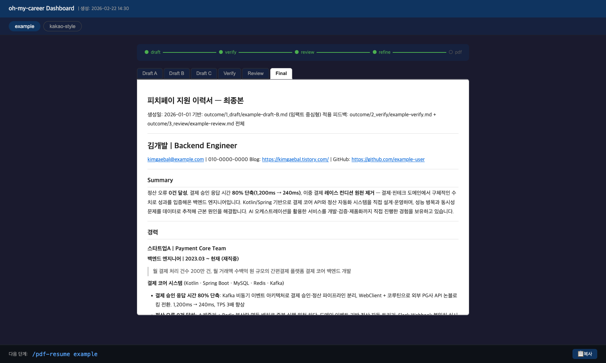

# oh-my-career 🚀


JD를 분석해 맞춤 이력서를 자동 생성하고, 면접까지 준비하는 Claude Code 기반 구직 자동화 시스템.

> 📦 **예시 파일 포함**: `src/my-resume.md` (가상 인물), `src/example-jd.md`, `outcome/` 예시 출력물로 파이프라인 전체 흐름을 즉시 확인할 수 있습니다.

---

## ⚠️ AI를 보조 도구로 활용하세요

이 파이프라인은 이력서 작성을 **자동화**하지만, 최종 결과물의 품질은 **당신의 검토**에 달려 있습니다.

> **각 단계 결과물을 반드시 직접 열어서 읽어보세요.**<br>
> AI가 생성한 내용 중 어색한 표현, 불필요한 내용, 또는 본인 스타일과 맞지 않는 부분은 직접 수정하거나 제거하는 것을 권장합니다.<br>
> 에이전트의 출력을 100% 신뢰하지 말고, 항상 **본인이 최종 편집자**라는 관점으로 활용하세요.

---

## 파이프라인 개요

```
src/my-resume.md  +  src/pending/{company}_jd.md
          │
          ▼
  /evaluate-jd       →  outcome/{company}/0_evaluate/{company}-evaluate.md   (사전 필터)
          │
          ▼
   /draft-resume     →  outcome/{company}/1_draft/{company}-draft-{A|B|C}.md
          │
          ▼
  /verify-resume     →  outcome/{company}/2_verify/{company}-verify.md
          │
          ▼
  /review-resume     →  outcome/{company}/3_review/{company}-review.md
          │
          ▼
  /refine-resume     →  outcome/{company}/4_refine/{company}-final.md
          │
          ▼
  /final-check       →  outcome/{company}/4_refine/{company}-final-check.md  (채용자 시각 최종 게이트)
          │
          ▼
    /pdf-resume      →  outcome/{company}/5_pdf/{company}-final.html + .pdf
          │              └─ 완료 시 JD를 src/pending/ → src/applied/ 로 이동
          ▼
    /portfolio       →  outcome/{company}/6_portfolio/{company}-portfolio.html + .pdf  (선택)

  ── 면접 ──────────────────────────────────────────────────

  /story-bank        →  outcome/interview/story-bank.md              (회사 공통)
                        outcome/{company}/interview/{company}-interview.md
  /interview-debrief →  outcome/{company}/interview/{company}-debrief-{N}차.md
                        outcome/interview/debrief-index.md           (회차 누적)
                        outcome/interview/question-bank.md           (질문 은행)
```

---

## 🚀 빠른 시작

### 1단계: 파일 준비

```
src/
├── my-resume.md              ← 내 원본 이력서 작성 (팩트 기준, 절대 수정 금지)
├── pending/{company}_jd.md   ← 미지원·진행중 JD 붙여넣기
└── applied/{company}_jd.md   ← /pdf-resume 완료 시 자동 이동
```

> `{company}` 예시: `kakao`, `toss`, `line-plus` 등 회사명 영문 소문자

💡 **JD 수집 팁**: 채용 공고 URL 앞에 `r.jina.ai/`를 붙이면 광고·노이즈 없이 깨끗한 텍스트 형태로 JD를 가져올 수 있습니다.
```
# 예시
https://r.jina.ai/careers.kakao.com/jobs/12345
```
가져온 내용을 `src/{company}-jd.md`에 붙여넣으면 AI가 훨씬 정확하게 분석합니다.

### 2단계: Claude Code에서 파이프라인 실행

```bash
# Claude Code 실행
claude

# (선택) JD 적합도 사전 평가 — B 이상이면 지원 추천
/evaluate-jd

# 슬래시 커맨드 순서대로 실행
/draft-resume
/verify-resume
/review-resume
/refine-resume
/final-check
/pdf-resume

# (선택) 포트폴리오 첨부를 요구할 때
/portfolio

# (선택) 면접 준비 — STAR 스토리 뱅크 생성
/story-bank

# 면접을 본 뒤 — 녹취를 넣으면 복기 리포트 + 회차 누적
/interview-debrief {녹취 파일 경로}
```

각 커맨드를 실행하면 Claude가 자동으로 파일을 읽고 결과물을 `outcome/` 하위 폴더에 저장합니다.

> 💡 **중간 결과물이 쌓여 파일을 일일이 열어보기 번거로울 때**: `/dashboard`를 실행하면 `outcome/` 전체를 스캔해 브라우저에서 바로 볼 수 있는 `dashboard.html`을 생성합니다. 자세한 내용은 [📊 파이프라인 대시보드](#-파이프라인-대시보드) 섹션을 참고하세요.

---

## 📁 디렉토리 구조

```
oh-my-career/
├── src/
│   ├── my-resume.md          # 원본 이력서 (팩트 기준 — 절대 수정 금지)
│   └── {company}-jd.md       # 지원 회사 JD
├── instruction/              # 워크플로우 추가 지침 (선택)
├── .claude/
│   └── skills/               # 파이프라인 스킬 정의
│       ├── evaluate-jd/
│       ├── draft-resume/
│       ├── verify-resume/
│       ├── review-resume/
│       ├── refine-resume/
│       ├── final-check/
│       ├── pdf-resume/
│       ├── portfolio/
│       ├── story-bank/
│       ├── interview-debrief/
│       └── dashboard/
└── outcome/
    ├── {company}/            # 회사(=JD)별 패키지 — 모든 단계 산출물이 이 안에 모임
    │   ├── 0_evaluate/       # JD 적합도 평가 리포트
    │   ├── 1_draft/          # 초안 3가지 (A/B/C 버전)
    │   ├── 2_verify/         # 팩트 검증 + JD 정합성 리포트
    │   ├── 3_review/         # 품질 리뷰 리포트
    │   ├── 4_refine/         # 마크다운 최종본
    │   ├── 5_pdf/            # HTML + PDF 제출본
    │   ├── 6_portfolio/      # 딥다이브 포트폴리오 (선택)
    │   └── interview/        # 회사별 면접 준비 + 복기 리포트·녹취
    └── interview/            # 회사 공통 자산 (최상위 유지)
        ├── story-bank.md         # STAR+R 스토리 뱅크
        ├── debrief-index.md      # 면접 복기 회차 누적 + 반복 지적 추적
        ├── question-bank.md      # 실제로 받은 질문 은행
        ├── whiteboard-3frames.md # 화이트보드 3프레임 (AS-IS/선택지/TO-BE)
        └── cdc-pipeline-script.md # 스토리별 답변 대본 (회사 무관)
```

---

## 📝 파일 명명 규칙

```
outcome/{company}/0_evaluate/{company}-evaluate.md
outcome/{company}/1_draft/{company}-draft-{A|B|C}.md
outcome/{company}/2_verify/{company}-verify.md
outcome/{company}/3_review/{company}-review.md
outcome/{company}/4_refine/{company}-final.md
outcome/{company}/4_refine/{company}-final-check.md
outcome/{company}/5_pdf/{company}-final.html
outcome/{company}/5_pdf/{company}-final.pdf
outcome/{company}/6_portfolio/{company}-portfolio.html
outcome/{company}/interview/{company}-interview.md
outcome/{company}/interview/{company}-debrief-{N}차.md
outcome/{company}/interview/raw/{company}-{N}차-녹취.md
outcome/interview/story-bank.md
outcome/interview/debrief-index.md
outcome/interview/question-bank.md
```

**예시** (피치페이 지원 시):
```
src/pending/peachpay_jd.md
outcome/peachpay/1_draft/peachpay-draft-A.md
outcome/peachpay/1_draft/peachpay-draft-B.md
outcome/peachpay/1_draft/peachpay-draft-C.md
outcome/peachpay/2_verify/peachpay-verify.md
outcome/peachpay/3_review/peachpay-review.md
outcome/peachpay/4_refine/peachpay-final.md
outcome/peachpay/5_pdf/peachpay-final.html
outcome/peachpay/5_pdf/peachpay-final.pdf
```

---

## 🔍 각 단계 설명

### 0. `/evaluate-jd` — JD 적합도 사전 평가 (선택)

JD와 원본 이력서를 대조해 **10차원 가중 스코어링**으로 A-F 등급을 산출합니다.

| 등급 | 판정 |
|------|------|
| **A** (4.5-5.0) | 강력 추천 — 거의 완벽한 매칭 |
| **B** (3.5-4.4) | 추천 — 강점이 갭을 충분히 커버 |
| **C** (2.5-3.4) | 검토 필요 — 매칭되지만 갭 존재 |
| **D-F** | 비추천 — 시간 낭비 방지 |

- 강점 매칭, 갭 분석, 이력서 커스터마이징 가이드, 예상 면접 질문 Top 5 포함
- **B 이상이면 `/draft-resume`로 진행**, C 이하면 갭 분석 참고해 지원 여부 재검토

> 👀 **검토 포인트**: 등급이 낮아도 성장 가능성이나 도메인 흥미가 있다면 지원할 수 있습니다. 점수는 참고용이지 절대 기준이 아닙니다.

### 1. `/draft-resume` — 전략별 초안 3가지 생성

`src/my-resume.md`와 JD를 분석해 **서로 다른 전략**의 초안 3가지를 자동 생성합니다.

| 버전 | 전략 |
|------|------|
| A | 상세 서술형 — 기술 깊이·의사결정 과정 강조 |
| B | 임팩트 중심형 — 수치 성과를 최전면 배치 |
| C | 도메인 전문성 중심 — JD 키워드 밀도 최대화 |

> 👀 **검토 포인트**: 세 버전을 비교하며 본인의 강점을 가장 잘 드러내는 버전을 선택하세요. AI가 과장하거나 원본에 없는 내용을 추가했는지 반드시 확인하세요.

### 2. `/verify-resume` — 팩트 검증 + JD 정합성 체크

- 원본 이력서 대비 **수치/사실 오류 검출**
- JD 필수·우대 항목별 **커버리지 매핑**
- 버전별 **추천 순위** 결정

> 👀 **검토 포인트**: ❌ 항목은 반드시 처리해야 하지만, ⚠️ 항목은 맥락에 따라 유지할 수도 있습니다. 리포트를 맹목적으로 따르지 말고 직접 판단하세요.

### 3. `/review-resume` — 채용자 시각 품질 리뷰

- Summary/Bullets **STAR 밀도 분석**
- 표현 개선 제안 (Action only → Action + Result)
- 분량, 구조, 키워드 커버리지 종합 점수

> 👀 **검토 포인트**: 제안된 표현이 어색하거나 본인 목소리와 다르다면 그냥 넘기세요. 리뷰는 참고용이지 정답이 아닙니다.

### 4. `/refine-resume` — 마크다운 최종본 생성

- 검증·리뷰 피드백을 모두 반영한 **마크다운 최종본** 생성
- 콘텐츠 완성 단계 — 레이아웃 변환은 5단계에서 처리

> 👀 **검토 포인트**: 최종본을 처음부터 끝까지 직접 읽어보세요. 이전 단계에서 놓친 어색한 부분, 불필요한 내용, 삭제할 항목이 있다면 이 단계에서 직접 편집하는 것이 좋습니다.

### 4.5 `/final-check` — 채용자 시각 최종 게이트

15년차 시니어 채용담당자 시각으로 최종본을 JD와 대조해 **서류 통과 가능성을 냉정하게 판정**합니다. (read-only — 직접 수정하지 않고 지적·개선안만 제시)

- JD 필수·우대 요건별 **충분/약함/없음** 매칭표
- ATS 키워드, 정량화, 6초 스캔, 커리어 서사 일관성 점검
- 산문 구간 **AI 티(번역투·정형 문형·가운뎃점 과용 등)** 탐지 시 고친 문장까지 함께 제시 — 확인 후 최종본에 바로 반영

> 👀 **검토 포인트**: 판정이 '낮음'이면 수정 리스트를 반영한 뒤 재검토하세요. '높음/보통'이면 다음 단계로 진행합니다.

### 5. `/pdf-resume` — HTML + PDF 변환

- `outcome/4_refine/{company}-final.md`를 **스타일드 HTML**로 변환
- Chrome headless로 **A4 PDF** 자동 생성
- 프로필 사진(`src/photo.jpg`) 존재 시 헤더 우상단에 자동 삽입
- 콘텐츠 수정 없이 레이아웃·인쇄 CSS만 처리

> 👀 **검토 포인트**: 생성된 PDF를 열어 페이지 잘림, 폰트, 여백, 사진 위치를 눈으로 확인하세요. 필요 시 HTML 파일을 직접 수정한 뒤 PDF를 재생성하면 됩니다.

### 5.5 `/portfolio` — 딥다이브 포트폴리오 (선택)

지원 폼이 경력기술서와 **별도로 "포트폴리오 첨부"를 요구할 때만** 씁니다.

```
/portfolio {company}
```

- **경력기술서 ≠ 포트폴리오**: 경력기술서가 *짧게·스캔·호기심 남기기*라면, 포트폴리오는 *깊게·보여주기·호기심 해소*
- 대표 프로젝트 2-3개를 **아키텍처 다이어그램 + 설계 의사결정(왜) + 트러블슈팅 딥다이브 + 수치**로 풉니다
- 산출물: `outcome/{company}/6_portfolio/{company}-portfolio.html` + `.pdf`

> 👀 **검토 포인트**: 경력기술서와 문장을 재탕하면 실패입니다. 경력기술서에서 아낀 **메커니즘과 트레이드오프**가 여기 들어가야 합니다.

---

### 6. `/story-bank` — 면접 STAR 스토리 뱅크 (선택)

이력서의 경험들을 **STAR+R(Reflection) 구조**로 변환해 면접용 마스터 스토리를 축적합니다.

- **범용 모드** (`/story-bank`): 이력서 전체에서 5-10개 마스터 스토리 추출, 태그 분류 (#성능최적화 #장애대응 #아키텍처 #리더십 등)
- **회사별 모드** (`/story-bank {company}`): JD 기반 예상 질문 생성 + 마스터 스토리 매칭 + 역질문 추천
- 스토리 뱅크는 **누적 업데이트** — 이력서에 새 경험이 추가되면 자동으로 신규 스토리 append

> 👀 **검토 포인트**: AI가 생성한 Reflection이 본인의 실제 배움과 다르다면 직접 수정하세요. 면접에서 자연스럽게 말할 수 있는 표현이어야 합니다.

### 7. `/interview-debrief` — 면접 복기 (녹취 → 리포트)

면접 **녹취 텍스트**를 넣으면 그 자리에 배석했던 **시니어 면접관 시각**으로 복기합니다. 목적은 위로가 아니라 다음 면접의 합격률입니다.

```
/interview-debrief outcome/{company}/interview/raw/{company}-1차-녹취.md
```

- **질문별 분석**: 유형·꼬리질문 깊이·면접관 반응까지 메타데이터로 분해 (꼬리질문 3단 이상 = 가장 강한 신호)
- **🔴 사실 오류 + 이력서 대조**: `src/my-resume.md`와 대조해 **원본에 없는 수치·경험을 말했는지** 잡습니다
- **면접관 힌트 채굴**: *"저희는 보통 ~하는데요"* 류 발화를 전부 뽑아냅니다 — 그 팀의 실제 스택과 기대 답안이 거기 있습니다
- **⭐ 회차 누적**: `outcome/interview/debrief-index.md`에 회차·점수 추이를 쌓고, **2회 이상 반복된 지적은 자동으로 최우선 액션 아이템으로 승격**합니다 (`🔁 N회째`)
- 받은 질문은 `question-bank.md`에 append — 회사가 달라도 질문은 반복됩니다

> 👀 **검토 포인트**: 오디오만 있으면 먼저 텍스트로 변환하세요(클로바노트·다글로·MacWhisper). **화자 분리가 되면 정확도가 크게 올라갑니다.** 화자 분리가 없으면 문맥으로 추정하고, 추정 구간을 리포트에 표시합니다.

---

## 📊 파이프라인 대시보드

여러 회사에 동시에 지원하거나, 파이프라인을 며칠에 걸쳐 진행하다 보면 **결과물 파일을 하나씩 열어가며 현황을 파악하는 것이 번거로워집니다.** <br>
`/dashboard`를 실행하면 `outcome/` 전체를 자동 스캔해 브라우저에서 바로 확인할 수 있는 `dashboard.html`을 생성합니다.


```bash
/dashboard
```

생성된 파일은 프로젝트 루트의 `dashboard.html`에 저장됩니다. 브라우저에서 바로 열면 됩니다.

```
file:///path/to/oh-my-career/dashboard.html
```

### 대시보드 기능

| 기능 | 설명 |
|------|------|
| **회사 탭** | 감지된 회사를 탭으로 전환 — 새 회사 추가 후 재실행 시 자동 반영 |
| **진행률 스테퍼** | `● draft ─── ● verify ─── ○ review …` 완료/미완료 한눈에 파악 |
| **마크다운 뷰어** | Draft A/B/C · Verify · Review · Final 탭을 브라우저 내에서 바로 읽기 |
| **다음 단계 복사** | 현재 회사의 다음 커맨드를 클립보드에 복사 — Claude에 그대로 붙여넣기 |

### 예상 토큰 소비

`/dashboard` 실행 시 모든 MD 파일을 읽어 HTML에 임베드하기 때문에 파일이 많을수록 토큰 소비가 늘어납니다.

| 상황 | 예상 토큰 |
|------|-----------|
| 회사 1개 (5단계 완료 기준) | 약 25,000 ~ 35,000 |
| 회사 2개 | 약 45,000 ~ 60,000 |
| 회사 추가마다 | +20,000 ~ 25,000 |

> 파이프라인 전체 진행 중 토큰 소비 규모와 비슷하거나 약간 더 큽니다. 수시로 실행하기보다 **중간 점검이나 다음 단계 확인 시점**에 한 번씩 실행하는 것을 권장합니다.

---

## 🔒 핵심 규칙

- `src/my-resume.md`는 팩트 기준 — **이 파일의 수치/사실을 절대 변형하지 않는다**
- 원본에 없는 숫자나 사실을 생성하지 않는다
- 각 단계 결과물은 반드시 해당 `outcome/` 하위폴더에 저장한다
- **단계를 건너뛰지 않는다** (draft → verify → review → refine → pdf 순서 준수)

---

## 📂 예시 파일

이 레포에는 가상 인물 **김개발**을 기준으로 한 예시 파일이 포함되어 있습니다.

```
src/my-resume.md          → 가상 인물 예시 이력서 (결제/핀테크 백엔드 엔지니어)
src/example-jd.md         → 가상 회사 "피치페이" JD
outcome/1_draft/          → 전략별 초안 3가지 예시
outcome/2_verify/         → 팩트 검증 리포트 예시
outcome/3_review/         → 품질 리뷰 리포트 예시
outcome/4_refine/         → 마크다운 최종본 예시
outcome/5_pdf/            → HTML + PDF 예시
```

실제 사용 시 `src/my-resume.md`를 본인 이력서로 교체하고 지원 회사 JD 파일을 추가하면 됩니다.

---

## 🛠️ 사전 요구사항

- [Claude Code](https://claude.ai/code) 설치
- `~/.claude/` 디렉토리에 스킬 파일이 있거나 프로젝트 내 `.claude/skills/` 경로에 스킬이 위치해야 합니다

---

## 라이선스

MIT
