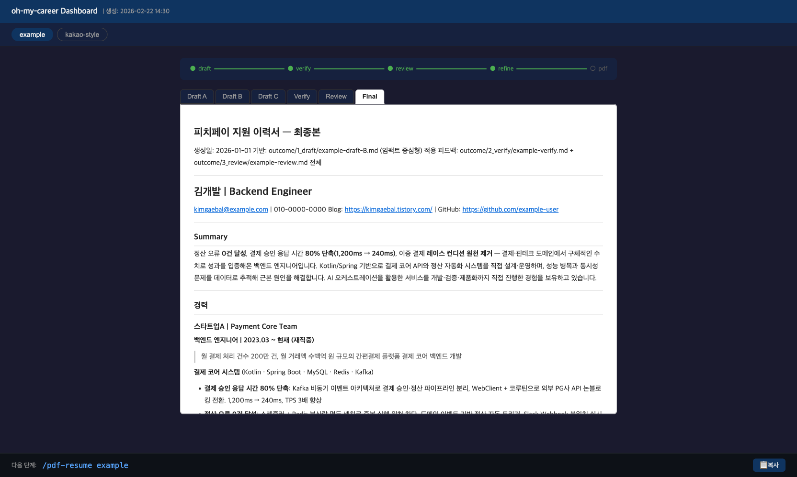

# oh-my-career 🚀



JD를 분석해 맞춤 이력서를 만들고, 면접까지 준비하는 Claude Code 기반 구직 자동화 시스템.

> ⚠️ **AI는 보조 도구입니다.** 각 단계 결과물을 직접 열어 읽고, 어색하거나 본인 목소리와 다른 부분은 고치세요.
> 최종 편집자는 당신입니다.

---

## 🚀 빠른 시작

**준비물**: [Claude Code](https://claude.ai/code), PDF 생성용 Google Chrome

### 1. 파일 두 개 넣기

```
src/.my/                          ← 개인정보 영역, 통째로 gitignore
├── my-resume.md                  ← 내 원본 이력서 (팩트 기준, 파이프라인이 수정하지 않는다)
└── jd/pending/{company}_jd.md    ← 지원할 공고
```

- 형식이 궁금하면 예시를 보세요: `src/example-my-resume.md`(가상 인물 김개발), `src/example-jd.md`(가상 회사 피치페이)
- `{company}`는 영문 소문자 (`peachpay`, `line-plus`)
- 💡 공고 URL 앞에 `r.jina.ai/`를 붙이면 광고 없이 깨끗한 텍스트로 가져옵니다 (`https://r.jina.ai/careers.kakao.com/jobs/12345`)

### 2. 커맨드 실행

```bash
claude

/evaluate-jd {company}     # 적합도 A-F 등급. 여기서 멈춘다 — 지원할지는 사람이 정한다
/draft-resume {company}    # 이것 하나로 리뷰까지 자동으로 간다
/refine-resume {company}   # 리뷰를 보고 나서, 여기부터는 직접 호출한다
/final-check {company}
/pdf-resume {company}      # 제출용 PDF. 끝나면 JD가 pending/ → applied/ 로 이동
```

---

## 파이프라인

```
/evaluate-jd        🛑 등급 판정. 지원 여부는 사람이 정한다
   │
   │  [자동] 리포트만 낸다. 제출본을 건드리지 않는다
   ├─ /draft-resume
   ├─ /verify-resume
   ├─ /cross-verify     🛑 BLOCK이면 멈춘다
   └─ /review-resume    🛑 누적 결과를 한 번에 보고
   │
   │  [수동] 제출본을 고친다. 사람이 시작한다
   ├─ /refine-resume    🛑 무엇을 고쳤는지 보고
   ├─ /final-check      🛑 수정 목록과 판정 근거 보고
   └─ /pdf-resume       ✅ 제출본 확정, JD를 applied/로

선택: /portfolio  /story-bank  /interview-debrief  /dashboard
```

**왜 나눴나**: 사고는 전부 뒤쪽 구간에서 났습니다. 수치가 엉뚱한 줄에 붙은 오귀속, 게이트 우회, 분량 게이트에서
떨어진 PDF가 "지원 완료"로 기록된 것. 앞 구간은 잘못돼도 리포트만 다시 만들면 되지만, 뒤쪽은 제출본이 바뀝니다.

---

## 🔍 단계별 설명

| # | 커맨드 | 하는 일 | 👀 직접 볼 것 |
|---|---|---|---|
| 0 | `/evaluate-jd` | 10차원 가중 점수로 A-F 등급. 강점, 갭, 커스터마이징 가이드, 예상 질문 | 점수는 참고용. 낮아도 지원할 이유가 있으면 지원 |
| 1 | `/draft-resume` | 전략이 다른 초안 3개. **A** ATS 키워드형, **B** 수치 임팩트형, **C** 스토리/문화핏형 | 원본에 없는 내용이 들어갔는지 |
| 2 | `/verify-resume` | 원본 대비 팩트 검증, JD 요건 커버리지, 추천 버전 | ⚠️는 맥락에 따라 유지해도 된다 |
| 2.5 | `/cross-verify` | 문맥을 모르는 서브 에이전트 5개가 수치 귀속, 시스템 경계, 인용 금지, 원본 미존재, JD 과장을 따로 검증. ❌ 1건이면 **BLOCK** | 건너뛰지 말 것. **값이 맞아도 붙은 자리가 틀린** 사고를 여기서 잡는다 |
| 3 | `/review-resume` | 채용자 시각 리뷰. STAR 밀도, Summary, 구조, 점수 | 본인 목소리와 다른 제안은 넘겨도 된다 |
| 4 | `/refine-resume` | 모든 피드백을 반영한 마크다운 최종본 + 변경 이력 | 처음부터 끝까지 직접 읽기 |
| 4.5 | `/final-check` | 15년차 채용 담당자 시각 최종 게이트. JD 매칭표, ATS, AI 티 문체 검사. **수정을 최종본에 직접 반영하고, 숫자가 바뀌면 교차검증을 다시 돌린다** | 반영된 수정 목록. 판정 '낮음'이면 멈춘다 |
| 5 | `/pdf-resume` | 템플릿 기반 HTML + A4 PDF. 분량(목표 2쪽, 상한 3쪽) 실측, 사진(`src/photo.jpg`) 있으면 삽입 | PDF를 열어 잘림, 여백, 빈 페이지 확인 |

### 선택 스킬

| 커맨드 | 언제 | 하는 일 |
|---|---|---|
| `/portfolio {company}` | 지원 폼이 포트폴리오를 따로 요구할 때 | 대표 프로젝트 2-3개를 아키텍처 다이어그램, 설계 결정(왜), 트러블슈팅으로 깊게 푼 PDF. 경력기술서 문장을 재탕하면 실패 |
| `/story-bank [company]` | 면접 준비 | 이력서를 STAR+R 마스터 스토리로 누적. 회사를 주면 예상 질문과 매칭, 역질문 추천 |
| `/interview-debrief {녹취}` | 면접 직후 | 시니어 면접관 시각 복기. 사실 오류와 **원본에 없는 수치를 말했는지** 대조, 면접관 힌트 채굴, 2회 이상 반복된 지적은 최우선으로 승격 |
| `/dashboard [company]` | 회사가 여러 개일 때 | `outcome/`을 스캔해 `dashboard.html` 생성 (아래) |

> 오디오만 있으면 먼저 텍스트로 바꾸세요 (클로바노트, 다글로, MacWhisper). 화자 분리가 되면 복기 정확도가 크게 오릅니다.

---

## 📊 대시보드

```bash
/dashboard            # 현황 모드: 파일 존재만 확인. 가볍다 (기본)
/dashboard peachpay   # 상세 모드: 그 회사 리포트를 브라우저에서 읽기
/dashboard --all      # 전 회사 상세. 토큰을 많이 쓴다
```

프로젝트 루트에 `dashboard.html`이 생깁니다. 회사 탭, 8단계 진행 표시(교차검증과 최종 검토 게이트 포함),
리포트 뷰어, 다음 커맨드 복사 버튼이 있습니다.

---

## 📁 산출물 위치

회사마다 `outcome/{company}/` 한 폴더에 모든 단계가 쌓입니다.

```
outcome/
├── {company}/
│   ├── 0_evaluate/   적합도 평가
│   ├── 1_draft/      초안 A/B/C
│   ├── 2_verify/     팩트 검증 + 교차검증
│   ├── 3_review/     품질 리뷰
│   ├── 4_refine/     최종본 (final.md), 최종 검토, 변경 이력
│   ├── 5_pdf/        제출용 HTML + PDF
│   ├── 6_portfolio/  포트폴리오 (선택)
│   └── interview/    회사별 면접 준비, 복기, 녹취
└── interview/        회사 공통: 스토리 뱅크, 복기 인덱스, 질문 은행
```

파일 이름은 `{company}-{단계}.md` 규칙입니다 (예: `outcome/peachpay/1_draft/peachpay-draft-A.md`).
전체 목록과 스킬이 따르는 규칙은 [`CLAUDE.md`](CLAUDE.md)에 있습니다.

---

## 🔒 지키는 규칙

- **원본 이력서의 수치와 사실을 바꾸지 않는다.** 원본에 없는 숫자는 만들지 않는다
- **단계를 건너뛰지 않는다.** 교차검증이 PASS가 아니면 하류 단계가 전부 시작을 거부한다
- `src/.my/`, 사진, `outcome/`은 gitignore. 개인정보와 산출물은 레포에 올라가지 않는다 (예시 파일 두 개만 추적)

## 라이선스

MIT
